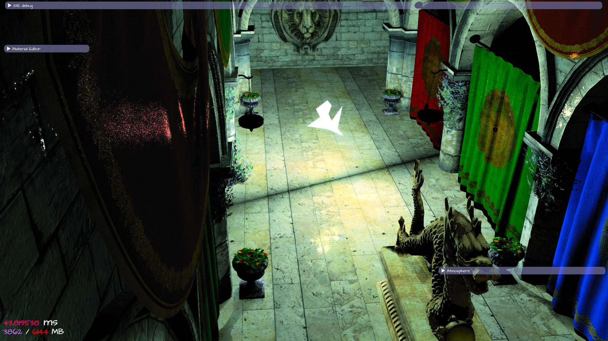
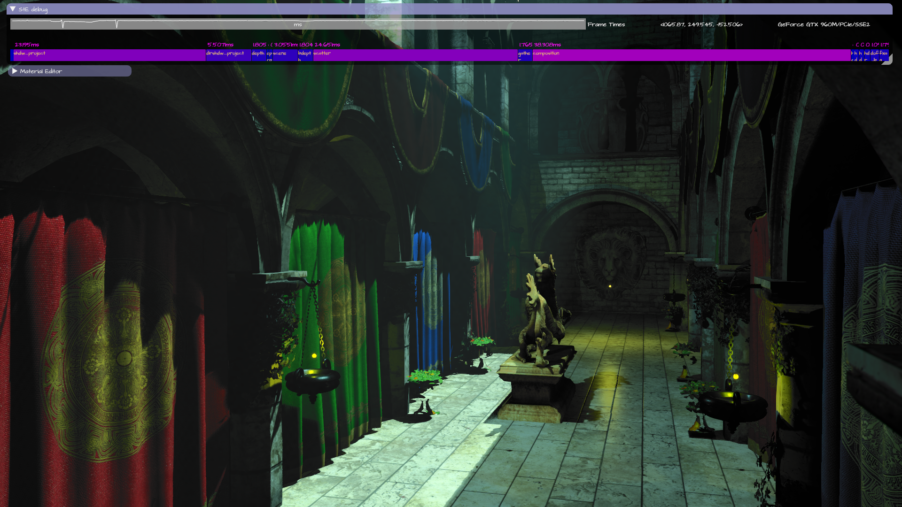

# ste, real time graphics engine

docs: https://rawgit.com/ssteinberg/ste/docs/Simulation/docs/html/index.html

   
  
Shaped light sources: Spheres, simple convex or concave polygons and convex polyhedrons. Integrated diffuse and specular cross section for arbitrary microfacet materials. 
  

  
Multi-layered microfacet materials 
  

  
Volumetric lighting 
   
  

  
Atmospheric multiple-scattering 
  
  

© Shlomi Steinberg
http://www.shlomisteinberg.com

This work is licensed under a CC Attribution-NonCommercial 4.0 International (CC BY-NC 4.0) License
https://creativecommons.org/licenses/by-nc/4.0/
